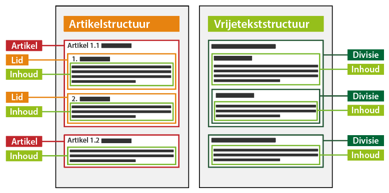

#### Tekststructuren

Het onderstaand figuur is een conceptuele weergave van de tekststructuren. Links
de artikelstructuur met artikelen en leden met inhoud. Te zien is dat wanneer
een artikel leden bevat, de inhoud in het lid voorkomt. Indien het artikel
inhoud bevat, zoals in artikel 1.2, is het niet mogelijk om in dat artikel ook
leden te plaatsen. Het rechtergedeelte van het figuur geeft de
vrijetekststructuur weer, waarin de divisies inhoud bevatten. Inhoud kan alléén
voorkomen in een divisie.

*Artikelstructuur en vrijetekststructuur*
