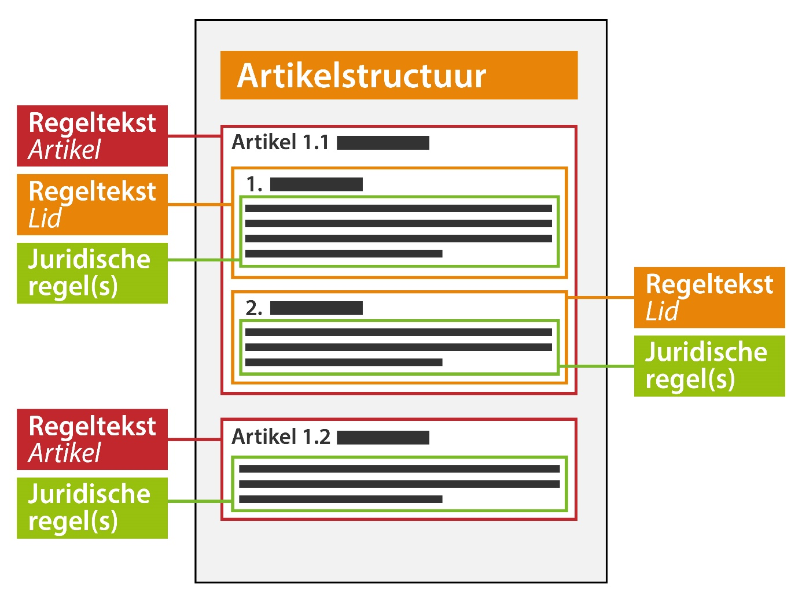

#### Regeltekst en juridische regel

Zoals in *2. Besluitonderdelen en tekstmodel* is uitgewerkt, bestaat een
OW-besluit uit tekst- en structuurelementen. Binnen de tekst- en
structuurelementen zijn informatiekundige elementen aangewezen waaraan
informatie gekoppeld kan worden. In OW-besluiten met een artikelstructuur (zoals
dit OW-besluit) is dit de regeltekst. Regeltekst is de kleinste zelfstandige
eenheid van (een of meer) bij elkaar horende juridische regels: een artikel of
lid. De regeltekst is in een tekst concreet aan te wijzen. Meer informatie over
regeltekst vind je in paragraaf 6.4.1 van de TPOD.

Een juridische regel is de beschrijving van een regel met juridische
werkingskracht. Het beschrijft welke regel er juridisch geldig is. Een
juridische regel is altijd onderdeel van een regeltekst. Een regeltekst kan een
of meerdere juridische regels bevatten.
Een juridische regel is een conceptuele constructie die noodzakelijk is om verschillende onderdelen van een regeltekst een eigen locatie te kunnen geven. Meer over het begrip locatie lees je verderop in deze pagina.

Meer informatie over de juridische regel vind je in paragraaf 6.4.2 van de TPOD.

*Conceptuele weergave van de juridische regels en regeltekst*

Bij bevraging in bijvoorbeeld DSO-LV zal altijd de volledige regeltekst als
resultaat worden weergegeven en niet de individuele juridische regel.

Om de regels te kunnen bevragen op de kaart in DSO-LV moet er een werkingsgebied
gekoppeld worden aan de regeltekst. Het koppelen van een werkingsgebied aan de
regeltekst is verplicht. Verderop in deze pagina vind je uitleg over
werkingsgebieden.

Verder is het mogelijk om de regeltekst te annoteren. Annoteren is noodzakelijk
om het bevragen van de regels in DSO-LV mogelijk te maken. Ook is het annoteren
noodzakelijk om de regels op een betekenisvolle manier te verbeelden op de kaart
in DSO-LV. Meer informatie over annoteren in relatie tot presenteren vind je in
paragraaf 7.1 van [het Presentatiemodel].
