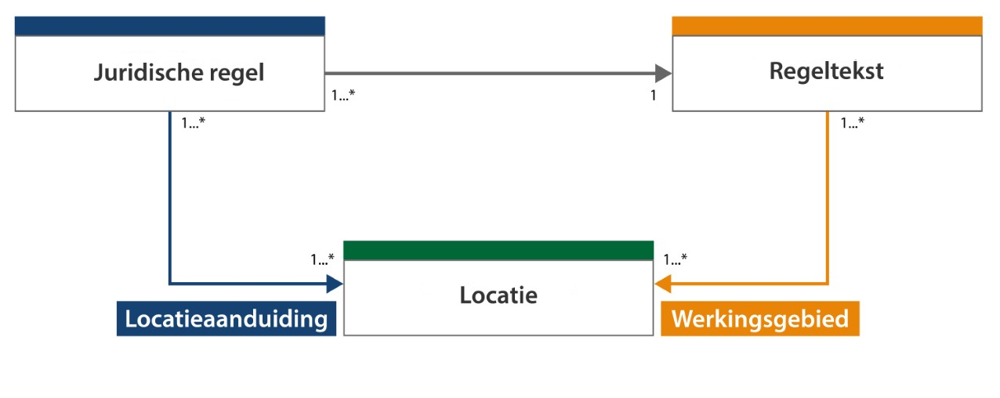

#### Locatie en werkingsgebied in context

Om de termen locatie en werkingsgebied en hun onderlinge relatie goed te kunnen
duiden is een toelichting nodig op begrippen die met deze twee termen van doen
hebben. In de onderstaande figuur zijn deze begrippen in vereenvoudigde weergave
met elkaar in verband gebracht.

*Conceptuele weergave van locatie en werkingsgebied en de relatie met andere
relevante begrippen*

In de gepresenteerde samenhang van de begrippen wordt duidelijk dat een locatie
op twee manieren kan worden ‘aangeroepen’:

-   als locatieaanduiding van een juridische regel (of annotatie);

-   als werkingsgebied van een regeltekst.

Om de betekenis van locatie en werkingsgebied goed te kunnen duiden worden in de
volgende delen de definitie en toepassing van de begrippen beschreven en
worden hun onderlinge relaties aan de hand van voorbeelden nader toegelicht.
