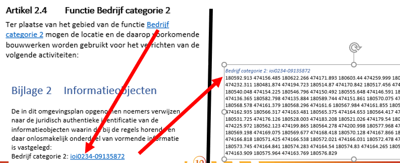

#### Onderlinge relatie werkingsgebied en regeltekst

De standaard vereist dat een werkingsgebied aan een regeltekst gekoppeld wordt.
Regeltekst bevat altijd ten minste één juridische regel, maar kan ook meerdere
juridische regels bevatten. Een juridische regel kan ook naar een specifieke
locatie in de fysieke leefomgeving verwijzen.

De locatie of locaties die betrekking hebben op het werkingsgebied van
regeltekst worden vastgelegd door een verwijzing naar een geografisch
informatieobject.

Een informatieobject in STOP/TPOD is een zelfstandige entiteit voor het opslaan
en via internet ontsluiten van informatie die onderdeel van een besluit is, maar
niet op een voor de mens leesbare manier in de tekst van dat besluit kan worden
weergegeven. Het geografisch informatieobject is een informatieobject met ten
minste één geometrie. Naast geometrie kan een geografisch informatieobject ook
waarden bevatten, zoals waarden voor omgevingsnormen.

De verwijzing naar het geografisch informatieobject komt tot stand door in de
juridische regel de noemer van het geografisch informatieobject (en dus ook van
de locatie) op te nemen. Deze noemer is een tekstuele aanduiding van de
gegevensset, waaruit een lezer kan begrijpen waar het geografisch
informatieobject (de locatie) betrekking op heeft.

Een (geografisch) informatieobject kan door meerdere regelingen en/of besluiten
worden gebruikt. Door in de tekst van het besluit naar het informatieobject te
verwijzen krijgt het informatieobject juridische status en wordt het onderdeel
van het besluit. Met de noemer en de unieke identificatie kan de verwijzing
vanuit de tekst gerealiseerd worden, waardoor het geografisch informatieobject een
juridische status krijgt.

In onderstaand voorbeeld bevat een regeltekst één juridische regel met één
werkingsgebied, dat informatiekundig één locatie is. In zo’n geval kan de
regeltekst bijvoorbeeld als volgt luiden:

>   *Ter plaatste van het gebied van de functie Bedrijf categorie 2 mogen de
>   locatie en de daarop voorkomende bouwwerken worden gebruikt voor het [naam
>   activiteit].*

In dit voorbeeld is de locatie ‘Bedrijf categorie 2’. De verwijzing vanuit de
juridische regel, door middel van de noemer, naar de locatie maakt dat in dit
voorbeeld het gebied van de functie Bedrijf categorie 2 het werkingsgebied is
van de regeltekst.

De locatie ‘Bedrijf categorie 2’ wordt vastgelegd in een geografisch
informatieobject met de noemer ‘Bedrijf categorie 2’.

*Verwijzing vanuit de juridische regel, door middel van de noemer, naar de
locatie, maakt dat het gebied van de functie Bedrijfcategorie 2 het
werkingsgebied is van de regeltekst*

Door op een machineleesbare manier een verwijzing te maken van een regeltekst
naar een locatie, is het mogelijk om via de kaart te bevragen welke juridische
regels op een bepaalde locatie van toepassing zijn. Zo is de locatie ‘Bedrijf
categorie 2’ het werkingsgebied van de regeltekst. Daarnaast is het door middel
van het annoteren van activiteiten in relatie tot deze locatie mogelijk om
aan de slag te gaan met toepasbare regels.