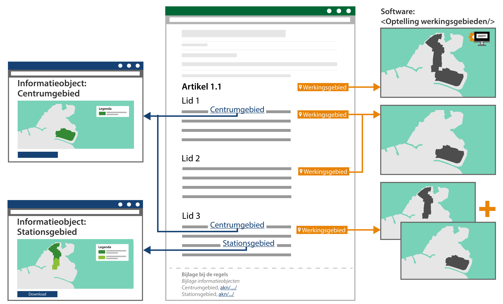

#### Regeltekst bevat meerdere juridische regels en meerdere locaties

In onderstaande figuur is in lid 1 sprake van een regeltekst die één juridische
regel met één locatie (‘Centrumgebied’) bevat.

*Conceptuele weergave van regelteksten met bijbehorende geografische
informatieobjecten en werkingsgebieden*

In lid 3 is een voorbeeld uitgewerkt van een regeltekst die meerdere juridische
regels bevat met meerdere locaties. In zo’n geval kan de regeltekst bijvoorbeeld
als volgt luiden:

*In het centrumgebied en in het stationsgebied is het toegestaan om zonder
vergunning of melding een horeca-inrichting te exploiteren.*

In dit voorbeeld zijn er twee locaties en derhalve twee geografische
informatieobjecten die bij de bekendmaking c.q. publicatie vastgelegd en
aangeleverd worden: 'het centrumgebied' en 'het stationsgebied'.

De twee locaties tezamen vormen het werkingsgebied van de regeltekst, want het
werkingsgebied van de regeltekst is dan de optelling van de locaties van alle
juridische regels die samen de regeltekst vormen. Het werkingsgebied van de
regeltekst van lid 3 is dus het ‘Centrumgebied’ én ‘Stationsgebied’ gezamenlijk.
