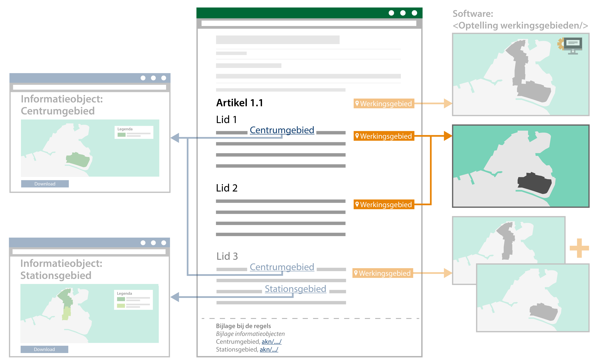

#### Werkingsgebied zonder noemer in de juridische regel

Wanneer er op een andere plek in het omgevingsdocument een locatie benoemd is
(met een noemer en een unieke identificatie), kan het voorkomen dat dit niet in
de regeltekst herhaald wordt. Het is dan mogelijk om, door middel van de
software, alsnog de regeltekst te koppelen aan het gewenste werkingsgebied. De
regeltekst blijft daarmee bevraagbaar via de kaart op dat werkingsgebied, zonder
dat de lezer van de regeltekst in dat specifieke stuk regeltekst kan zien dat
het gekoppeld is. De lezer zal het weten doordat het in dat hoofdstuk of artikel
wel beschreven is.

In onderstaande figuur is in lid 2 een voorbeeld geïllustreerd van een
regeltekst waarbij niet expliciet een locatie is benoemd.

*Conceptuele weergave van werkingsgebied zonder noemer in de juridische regel*

De standaard vereist dat een werkingsgebied aan een regeltekst gekoppeld wordt.
Dat hoeft niet te betekenen dat een mens dat altijd handmatig hoeft te doen. De
software kan die taak gemakkelijker maken, bijvoorbeeld door werkingsgebieden
aan grotere delen van de tekst te koppelen (mits dat juridisch juist is). In dit
voorbeeld heeft de software de regeltekst aan het werkingsgebied van voorgaande
regeltekst gekoppeld. In dit voorbeeld is dat het 'Centrumgebied' uit lid 1.

Het werkingsgebied geeft de geometrische afbakening aan waar een regeltekst zijn
juridische werking heeft. Het is wel aan de lezer van de regeltekst om te
interpreteren waar, binnen deze geometrische afbakening, de regeltekst wel en
niet zijn werking heeft.
