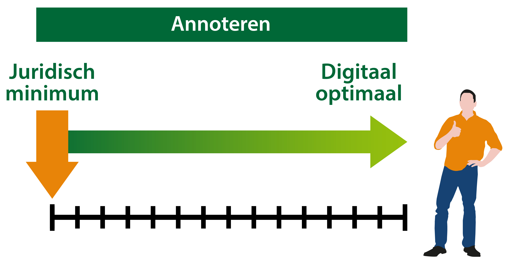

#### Waarom annoteren?

STOP en IMOW maken het mogelijk om een regeltekst een werkingsgebied te geven
door een verwijzing naar de locatie van de regeltekst op te nemen. Een computer
weet dan dat beide bij elkaar horen, maar kan geen verdere betekenis aan die
relatie geven. Ook kan het werkingsgebied niet voor een mens betekenisvol op een
kaart weergegeven worden.

Dit kan wel met het mechanisme van annoteren: het toevoegen van gegevens aan
(onderdelen van) besluiten en regelingen die die besluiten en regelingen
machineleesbaar maken. Annoteren zorgt er voor dat het besluit of de regeling
gestructureerd bevraagbaar is en dat werkingsgebieden en andere gegevens op een
kaart weergegeven worden. Het annoteren kan ook helpen bij het verbinden van
toepasbare regels, oftewel vragenbomen, aan regels met werkingsgebieden. Voor
het annoteren van OW-besluiten gebruikt TPOD de IMOW-objecten.

Annoteren is niet verplicht, maar wel noodzakelijk om het afgesproken
dienstverleningsniveau van het DSO-LV te bereiken. Ieder bevoegd gezag kan zelf
bepalen wanneer het digitaal optimaal is. Dit hangt af van het ambitieniveau, de
beschikbare capaciteit voor het opstellen van het OW-besluit en de beschikbare
capaciteit voor het beheer.

*Annotatie-schaal van juridisch minimum tot digitaal optimaal*

In welke mate er geannoteerd wordt is dus een afweging die per bevoegd gezag
gemaakt dient te worden.
