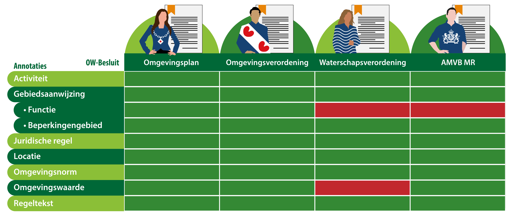
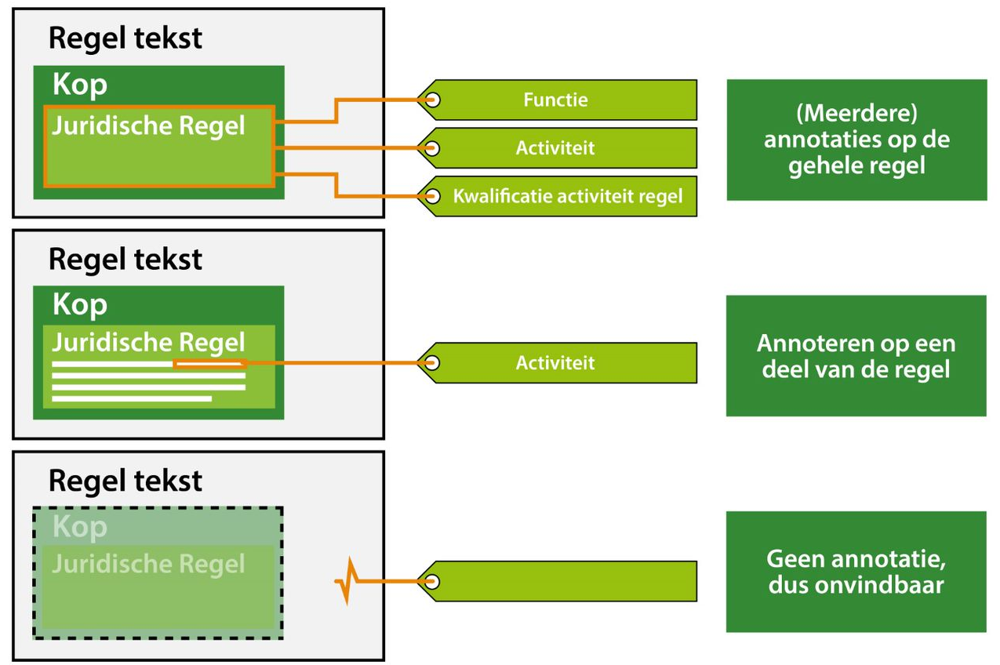

#### Toepassen van annoteren

In het IMOP is vastgelegd welke mogelijkheden er zijn met betrekking tot
annoteren. In de TPOD is vervolgens gespecificeerd van welke annotatie
mogelijkheden er gebruik gemaakt kan of moet worden volgens IMOW. In
onderstaande tabel is voor de omgevingswet- en services annotaties uitgewerkt
welke van toepassing zijn in welke OW-besluiten. Een kleine leeswijzer:

Groen=Van toepassing

Rood=Niet van toepassing

*Annotatiemogelijkheden per OW-besluit*

In de TPOD van het specifieke OW-besluit is in elke paragraaf 6.4 nader
uitgewerkt wat deze annotaties omvatten. Het is niet de bedoeling om in deze
praktijkrichtlijn volledig alle annotaties uit te werken, maar om meer
uitwerking te geven aan hoe die annotaties in de praktijk gaan werken.

Een regeltekst kun je annoteren op een van bovenstaande annotaties. Ook
deze bevatten weer eigen typen en attributen. Wordt de regeltekst niet
geannoteerd dan is deze als regel ook niet vindbaar of gekwalificeerd. Zie
onderstaande figuren voor een schematische weergave.

*Annoteren regeltekst*

In elke TPOD van de afzonderlijke OW-besluiten is aangegeven of de annotaties in
het OW-besluit kunnen voorkomen. Daarnaast is aangegeven welke regels er gelden
voor het gebruik van de annotatie.