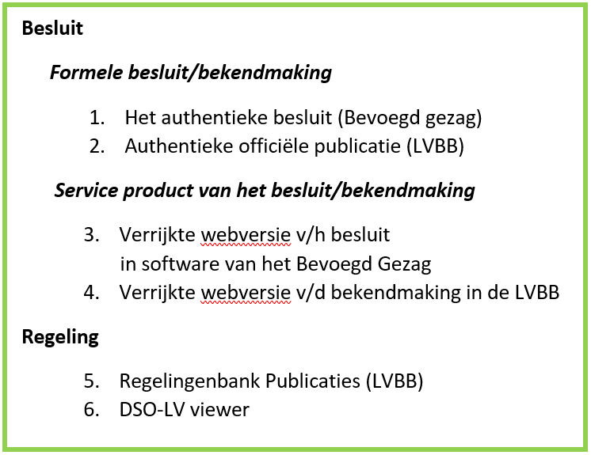

#### Verschijningsvormen van een OW-besluit

Het presentatiemodel maakt de inhoud van de digitale informatie uit juridische
OW-besluiten, die worden opgeslagen in xml-bestanden, toegankelijk en leesbaar
voor de gebruiker. Er zijn verschillende vormen waarop de inhoud van een
OW-besluit wordt weergegeven. Deze zijn beschreven in onderstaande figuur.

*Overzicht van de verschillende vormen waarop een OW-besluit wordt weergegeven*

Meer informatie over de verschijningsvormen van een OW-besluit vind je in
Hoofdstuk 2 van het [Presentatiemodel](https://www.geonovum.nl/geo-standaarden/omgevingswet/STOPTPOD).

Het presentatiemodel beschrijft alle generieke onderdelen die nodig zijn voor
het presenteren van vaststellingsbesluiten en wijzigingsbesluiten van een
OW-besluit. Er zijn ook onderdelen die alleen van toepassing zijn op
wijzigingsbesluiten. Deze onderdelen worden separaat toegelicht.
