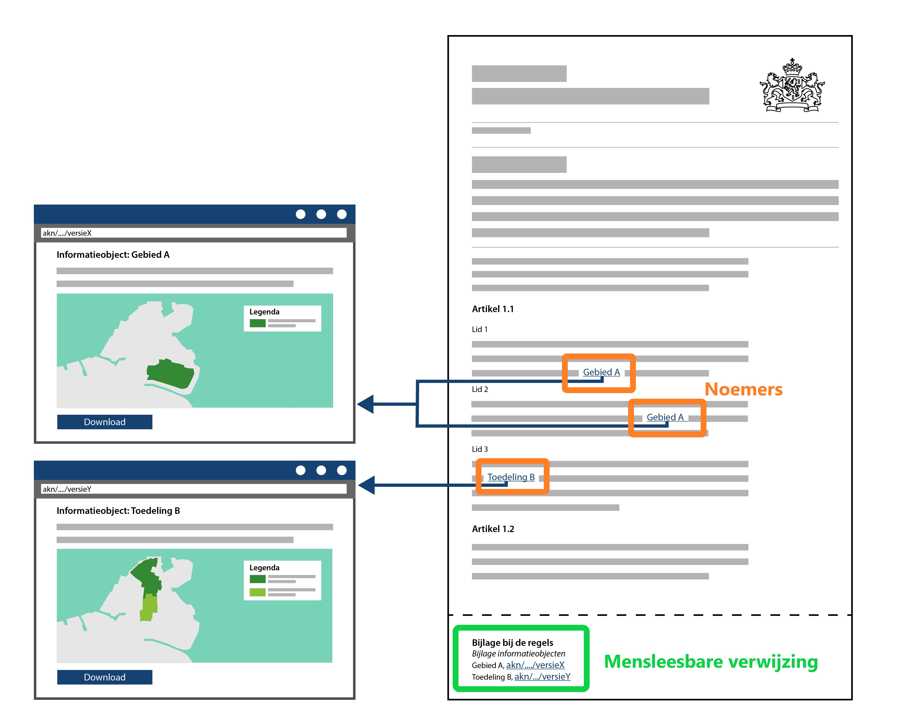

#### Presenteren van een besluit

Een besluit bestaat uit de verschillende besluitonderdelen (regelteksten of
teksten met een vrijetekststructuur), inclusief de verwijzing naar
(geografische) informatieobjecten.

Informatieobjecten in een OW-besluit dienen in de mensleesbare weergave van het
besluit opgenomen te worden zodat duidelijk is welke informatie als onderdeel
van het besluit is vastgesteld. Het presentatiemodel legt de verbinding tussen
het informatieobject en het besluit door de noemer van het informatieobject in
de tekst op te nemen. Op deze wijze wordt het informatieobject onderdeel van het
juridische besluit.

Onderstaande figuur geeft conceptueel weer hoe vanuit het juridische besluit
verwezen wordt naar het informatieobject.

*Mensleesbare noemers en verwijzingen naar geografische informatieobjecten in de
tekst van het besluit*

Meer informatie over de presentatie van het besluit vind je in Hoofdstuk 4 van
het [Presentatiemodel](https://www.geonovum.nl/geo-standaarden/omgevingswet/STOPTPOD).

Er bestaat ook een serviceproduct van het besluit/bekendmaking. Een service
product van het besluit/bekendmaking is een verrijkte webversie van het besluit.
Hier kan extra context aan zijn toegevoegd waardoor de inhoud van het besluit op
diverse manieren raadpleegbaar en bevraagbaar is. Het is toegankelijker, maar
niet authentiek.

Meer informatie over de presentatie van het serviceproduct van het
besluit/bekendmaking vind je in Hoofdstuk 5 van het [Presentatiemodel](https://www.geonovum.nl/geo-standaarden/omgevingswet/STOPTPOD).
