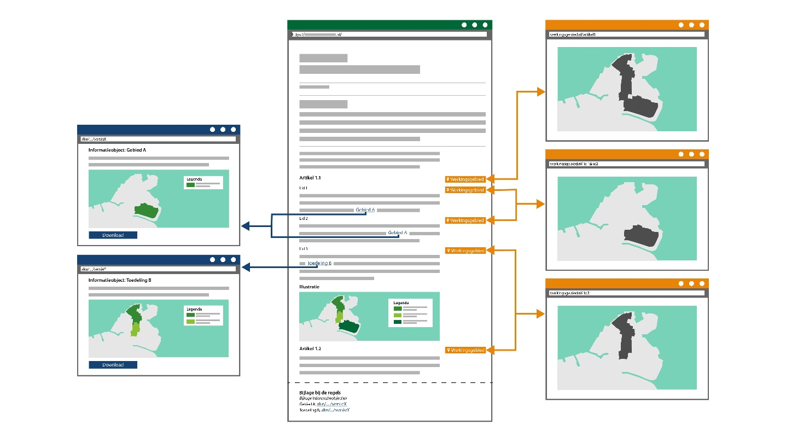
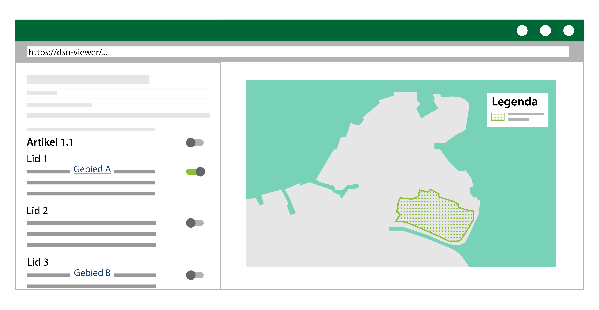

#### Presenteren van een regeling

De geconsolideerde regeling vormt de basis voor de weergave van de regeling in
de LVBB en van het OW-besluit dat in de DSO-viewer te raadplegen is. De
geconsolideerde versie van het OW-besluit bestaat uit de tekst, de bijbehorende
werkingsgebieden en geografische informatieobjecten.

Het verschil tussen de LVBB en de DSO-viewer is dat de LVBB document
georiënteerd is, terwijl de DSO-viewer geconsolideerde informatie laat zien over
de interbestuurlijke documenten heen en in combinatie met de ruimtelijke
plannen.

Onderstaande figuur toont een conceptuele weergave van een geconsolideerde
regeling in de LVBB.

*Conceptuele weergave van een geconsolideerde regeling in de LVBB*

Onderstaande figuur toont een conceptuele weergave van een geconsolideerde
regeling in de DSO-viewer.

*Conceptuele weergave van een geconsolideerde regeling in de DSO-viewer*

Voor de teksten in de LVBB en de DSO-viewer is het principe van functioneel
presenteren van tekst van toepassing. In de paragraaf Presenteren van tekst
wordt dit beschreven.

Voor de geografische informatieobjecten geldt ook het principe van functioneel
presenteren. Welke symbolisatiemethode hierbij toegepast kan worden, wordt
beschreven in de paragraaf Presentatie in kaartbeeld. De keuze die hierin
gemaakt wordt zal afhankelijk zijn van het medium waarin de regeling
geraadpleegd wordt en van de boodschap die een bevoegd gezag wil overbrengen.

Meer informatie over het presenteren van regelingen vind je in Hoofdstuk 6 van
het [Presentatiemodel](https://www.geonovum.nl/geo-standaarden/omgevingswet/STOPTPOD).
