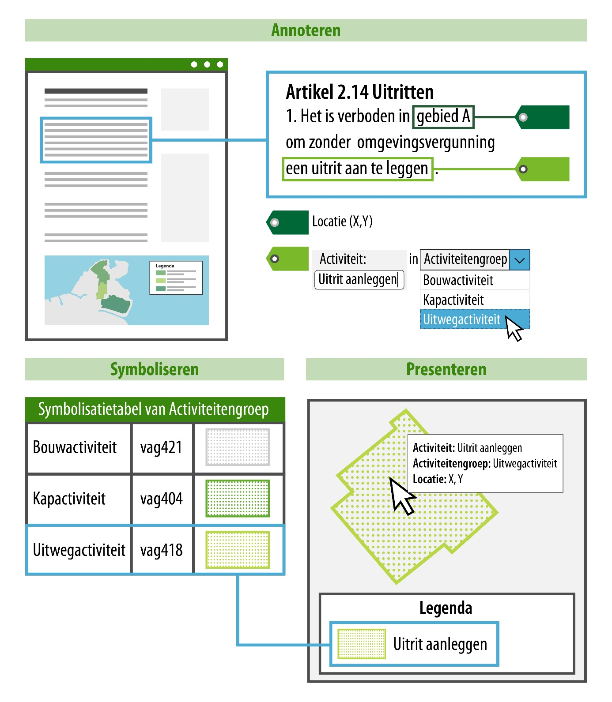

#### Presentatie in kaartbeeld: annoteren – symboliseren – presenteren

Voor de functionele presentatie in kaartbeeld is het annoteren van de regeltekst
belangrijk. De volgende inhoudelijke annotaties zijn gekoppeld aan een locatie
en kunnen daarom gebruikt worden om een geometrie te verbeelden:

-   Activiteit;

-   Gebiedsaanwijzing (functie en beperkingengebied);

-   Omgevingswaarde;

-   Omgevingsnorm.

In het presentatiemodel worden deze inhoudelijke annotaties en hun attribuut
*groep* gebruikt om te bepalen met welke symboliek (kleur/arcering) een locatie
in een kaartbeeld wordt weergegeven. Het principe hiervoor is generiek en kan
toegepast worden op alle bovenstaande annotaties.

Bovenstaande annotaties hebben een attribuut *groep*. Het attribuut *groep*
wordt gebruikt om de annotatie te verbinden aan een symbool waarmee de locatie
vervolgens verbeeld wordt op de kaart.

Dit principe kan het best toegelicht worden aan de hand van het voorbeeld in
onderstaande afbeelding.

*Conceptuele verbeelding van het principe annoteren - symboliseren -
presenteren*

In bovenstaand voorbeeld zie je een regeltekst waaraan een locatie is gekoppeld:
gebied A. Ook is in de regeltekst de activiteit geannoteerd: een uitrit
aanleggen. Bij het annoteren van de activiteit kan ook een activiteitengroep
gekozen worden, in dit geval: uitwegactiviteit. De activiteitengroep staat in de
symbolisatietabel waaraan een symbolisatie is gekoppeld, deze symbolisatie wordt
op de kaart als verbeelding van de activiteit getoond.

De waarde van het attribuut groep van de annotatie bepaalt dus de symbolisatie
waarmee de locatie wordt verbeeld op de kaart.

Ditzelfde principe kan ook toegepast worden op de annotaties gebiedsaanwijzing
(functie en beperkingengebied), omgevingswaarde en omgevingsnorm. Bij deze
annotaties zijn respectievelijk functiegroep, beperkingengebiedgroep,
omgevingswaardegroep en omgevingsnormgroep bepalend voor de symbolisatie waarmee
een locatie wordt verbeeld op de kaart.

Met welke exacte symboliek een locatie in een kaartbeeld wordt getoond is
afhankelijk van de symbolisatiemethode die wordt toegepast.

Het presentatiemodel biedt 4 verschillende mogelijkheden voor presenteren op de
kaart.

1.   Een default symbool.

2.   Symbolisatie op basis van een afgesproken standaard symbolisatie.

3.   Een eigen symbolisatie die afwijkt van de standaard symbolisatie.

4.   Een symbolisatie specifiek bedoeld voor een kaartviewer, afwijkend van
    bovenstaande symbolisatie.

Een uitleg over de 4 symbolisatiemethoden met voorbeelden vind je in paragraaf
4.2 van het [Presentatiemodel](https://www.geonovum.nl/geo-standaarden/omgevingswet/STOPTPOD).
