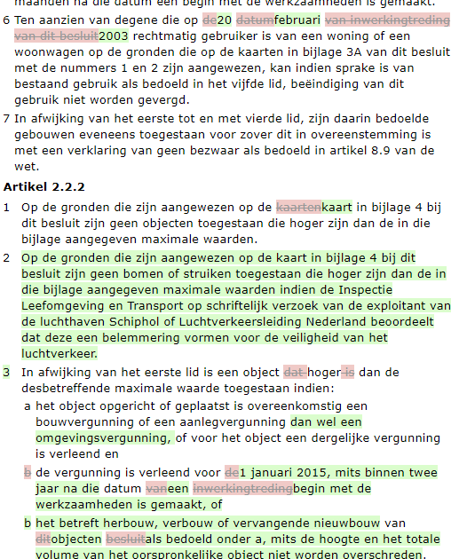
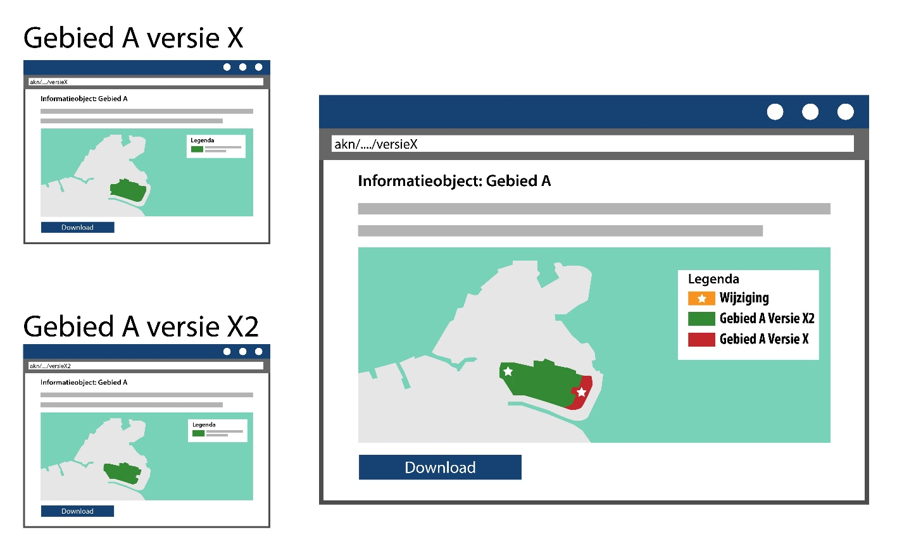

#### Wijzigingsbesluiten presenteren

Een wijzigingsbesluit dient in mensleesbare vorm datgene te tonen wat door het
besluit verandert in de geconsolideerde versie van de regeling. De tekst van de
regeling kan wijzigen, maar ook (de verwijzing naar) een informatieobject kan
wijzigen.

Het uitgangspunt van het presentatiemodel toegepast op wijzigingsbesluiten is
dat de wijzigingen expliciet zichtbaar gemaakt moeten worden middels een
renvooiweergave. De renvooiweergave houdt in dat de verschillen tussen de oude
en de nieuwe versie inzichtelijk gemaakt moeten worden door ze gecombineerd te
presenteren en dat ook de verschillen visueel moeten worden geduid.

In de geconsolideerde weergave van de regeling is de renvooiweergave niet
verplicht om de laatste wijzigingen te tonen. Het is wel mogelijk om ook hier de
laatste wijzigingen zichtbaar te maken, bijvoorbeeld door middel van een
renvooiweergave. Het is ook voor te stellen dat de renvooiweergave in de
geconsolideerde regeling een interactieve functionaliteit wordt voor de
gebruiker, zoals op wetten.nl. Het is dus niet verplicht om de renvooiweergave
te gebruiken in de geconsolideerde regeling, maar als dat gewenst is, is dat wel
mogelijk. Hiervoor stelt het presentatiemodel geen eisen. Het presentatiemodel
beschrijft alleen de richtlijnen voor de presentatie van wijzigingsbesluiten.

Meer informatie over het presenteren van wijzigingsbesluiten vind je in
Hoofdstuk 8 van het [Presentatiemodel](https://www.geonovum.nl/geo-standaarden/omgevingswet/STOPTPOD).

De renvooiweergave dient toegepast worden op tekst en op geografische
informatieobjecten.

Het wijzigingsbesluit via STOP kent geen wijzigingsinstructies, maar geeft de
verschillen aan. Het besluit dat aan de LVBB wordt geleverd bevat de te wijzigen
objecten/tekstonderdelen, en ook expliciet welke tekst is gewijzigd. De
verschillen worden hiermee ook meegeleverd.

Onderstaande afbeelding laat een voorbeeld zien van hoe de renvooiweergave van
tekst er uit kan zien.

*Voorbeeld van een tekst in renvooiweergave*

De renvooiweergave hoeft niet exact toegepast te worden in de stijl (kleuren,
font, grootte, arcering etc) zoals in bovenstaande afbeelding. Er mag ook voor
een andere weergavestijl gekozen worden. Aan de formulering van een
wijzigingsartikel dient wel toegevoegd te worden hoe de wijzigingen worden
gepresenteerd, bijvoorbeeld: “Het omgevingsplan wordt gewijzigd zoals in bijlage
A is aangegeven. De teksten die wijzigingen worden rood gemarkeerd en
doorgehaald weergegeven. De nieuwe tekst wordt groen gemarkeerd.“

Meer informatie over het presenteren van wijzigingen in tekst vind je in
paragraaf 8.2 van het [Presentatiemodel](https://www.geonovum.nl/geo-standaarden/omgevingswet/STOPTPOD).

De renvooiweergave wordt ook gebruikt om wijzigingen van geografische
informatieobjecten voor mensen zichtbaar te maken. Hier geldt ook dat het
wijzigingsbesluit de oude en de nieuwe versie inzichtelijk moet maken door ze
gecombineerd te presenteren, en dat ook de verschillen visueel moeten worden
geduid. Het presentatiemodel schrijft niet voor in welke stijl (kleur, arcering
etc) de verschillen geduid moeten worden.

Er zijn een aantal scenario’s waarbij de inhoud van geografische
informatieobjecten wijzigen:

1.  De inhoud van een bestaand geografisch informatieobject wijzigt; geometrie
    of een waarde;

2.  Het hele geografisch informatieobject wordt vervangen;

3.  Het geografisch informatieobject wordt vervangen door een nieuw geografisch
    informatie-object met een andere noemer.

Hieronder staat een conceptuele weergave van hoe de renvooiweergave toegepast
kan worden op een geografisch informatieobject waarvan de inhoud wijzigt.

*Conceptuele weergave van een interactieve kaartviewer met renvooiweergave van
een geografisch informatieobject: oude versie, nieuwe versie en wijzigingen
expliciet geduid*

Voor meer informatie en voorbeelden van hoe wijzigingen in geografische
informatieobjecten worden gepresenteerd, verwijzen we je naar paragraaf 8.3 van
het [Presentatiemodel](https://www.geonovum.nl/geo-standaarden/omgevingswet/STOPTPOD).
