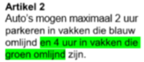
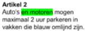
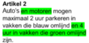

#### De stappen voor het wijzigen van tekst van een besluit

Voor een mutatie in de tekst van een besluit werkt het op gelijke wijze, zoals
met de activiteiten en de bijbehorende werkingsgebieden in het voorbeeld
hierboven. Alleen is er mogelijk geen mutatie zichtbaar in de werkingsgebieden,
maar slechts in de inhoud, ofwel de tekst.

Een voorbeeld hiervan is bijvoorbeeld dat bevoegd gezag een artikel 2 wil
aanpassen. Er staat slechts beschreven dat "Auto's 2 uur mogen parkeren in
vlakken die blauw omlijnd zijn", maar men is tot het nieuwe inzicht gekomen dat
dit ook geldt voor motoren.

In besluit 1 wordt daarom ook de aanpassing gemaakt dat "auto's en motoren 2 uur
mogen parkeren in vlakken die blauw omlijnd zijn". In de tekst is het groen
gemarkeerde deel toegevoegd.

Dan wordt er nog een aanpassing aan het artikel gemaakt. "Auto's mogen 4 uur
parkeren in de vakken die groen omlijnd zijn". Deze wijziging wordt meegenomen
in besluit 2.

Dit is een separaat besluit wat apart genomen is. Dan worden uiteindelijk de
twee besluiten samengevoegd en ontstaat er een geconsolideerde versie. Hierbij
is alle aangepaste tekst uit meerdere besluiten meegenomen in het nieuwe artikel
2.

Hierbij dient aangetekend te worden dat het uiteraard handiger is om de
besluiten zelf al samen te voegen en dan pas aan te merken als geconsolideerde
versie van artikel 2. Het moet maar net in de tekst passen en het scheelt veel
verschilberekeningen.
