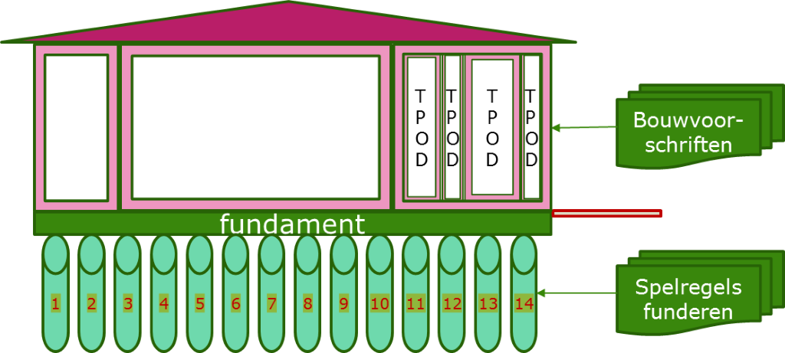

Huis van de STOP TPOD standaarden
---------------------------------

In deze praktijkrichtlijnen is ook is het principe van het *“Huis van de
STOP-TPOD-standaarden”* opgenomen. Dit huis is een metafoor voor het opbouwen
van inzicht, overzicht en handelingsperspectief m.b.t. de standaard. 

 

De metafoor spreekt over de hoofdelementen van een woning (de
STOP-TPOD-standaard als geheel) die samen de woning vormen, te weten:

-   Palen: Mechanismes waarop STOP/TP is gestoeld

-   Funderingssloven: CIM (Conceptueel Info Model Officiële Publicaties OP)

-   Vloer: CIM (Conceptueel Informatie Model Omgevingswet OW)

-   kolommen en muren: Informatiemodel IMOP en Architectuur van de standaard

-   dak: Documentatie en praktijkrichtlijnen

-   gevelsluitende elementen: TPOD Toepassingsprofielen per wetsinstrument van
    de Omgevingswet;

Daarbij komen dan nog de overige elementen die ook erg belangrijk zijn voor een
woning:

-   Binnen afwerking: Vrijheden van modelleren/formuleren van regels en
    werkingsgebieden

-   Buiten afwerking: Presentatiestandaard Service (DSO en BG)

-   Welstand: Presentatiestandaard Juridisch (bekendmaken)

-   Leefregels binnen: Beleidsvrijheid BG bij opstellen van regels en
    werkingsgebieden WAT WAAR

-   Leefregels met de buurt: Rekening houden met de medebewoners

-   Bewoners van de woning: Bevoegd gezag dat de standaard gebruikt

De *nieuwe spelregels voor bouwen* (de STOP-TPOD-standaard) bestaan uit twee
groepen:

-   De spelregels voor funderen van woningen (STOP/TP afgeleid van de
    Bekendmakingswet)

-   De spelregels voor bouwen voor de woning op het eiland “Leefomgeving”
    (TPOD’s die afgeleid zijn van de Omgevingswet).
