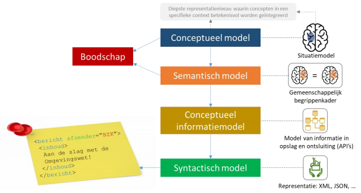

### Funderingssloven: Conceptueel Informatiemodel Overheidspublicaties (OP)

Via de funderingssloven (CIM OP) dragen de palen het gewicht van de woning. Die
funderingssloven zijn onderling samenhangend verbonden zorgen voor de
stabiliteit waarop de woning gebouwd wordt. Het CIM-OP vormt als het ware deze
funderingssloven. Er kunnen meerdere soorten vloeren op het fundament gelegd
worden. De fundering is Ow-onafhankelijk vormgegeven.

Het conceptueel informatiemodel gaat over de concepten die een rol spelen in een
domein, de begrippen, hun kenmerken en hun onderlinge relaties. Deze informatie
uit het domein kan daarmee opgevraagd en uitgewisseld kan worden. Deze
informatie wordt beschreven in de taal en terminologie en definities van dit
domein.

Relatie tussen conceptueel, semantisch, informatie- en syntactisch model

Het conceptuele model vormt samen met het conceptueel informatiemodel
(beschrijft welke informatie wordt vastgelegd), een raamwerk voor de concrete
invulling van het semantische model (begrippenkader) van de Omgevingswet.

Een goed voorbeeld hiervan is de functionele structuur. Hierin worden
activiteiten in de leefomgeving op basis van het concept “activiteit” samen met
hun kenmerken en onderlinge relaties vastgelegd.

Bij het uitwisselen van informatie gaat het primair om de boodschap die moet
worden overgebracht. Het conceptuele model is hierbij de context waarmee de
betekenis wordt gestuurd en het semantische model levert de concrete betekenis
van woorden en woordgroepen.

Syntactische modellen zorgen tot slot voor de vertaling in formaten die geschikt
zijn voor uitwisseling en opslag (beschrijft hoe informatie wordt vastgelegd).
Door de genoemde modellen in samenhang te ontwikkelen en beheren, wordt geborgd
dat de inhoud van de boodschap niet verloren gaat.

In dit conceptuele informatiemodel officiële publicaties worden de meest
belangrijke begrippen van de Bekendmakingswet beschreven. Hier komen we de
begrippen regeltekst, werkingsgebied, informatie-object tegen. Maar ook
begrippen uit het informatiedomein als data-object, data-collecties, geometrie
en waarde alsmede waardelijst en kenmerken. De gekozen begrippen zijn
domein-onafhankelijk gekozen omdat de Bekendmakingswet alle bekendmakingen over
alle domeinen regelt.

**Het CIM-OP is het referentiekader voor de formulering van het IMOP het
Informatie Model voor Officiële Overheidspublicaties.**

Een CIM beschrijft sec de informatie. Hoe en waar deze informatie precies
gebruikt wordt is geen onderdeel van een informatiemodel. Anders gezegd, de
informatie zoals beschreven in dit model mag overal waar dit nuttig is gebruikt
en toegepast worden. In een keten, in processen, in een product, in een API, in
XML of JSON et cetera. Het CIM is in deze onafhankelijk van implementatie en
techniek opgezet. Dit maakt het mogelijk om de informatie in verschillende
ketens en in verschillende technieken te implementeren, met behoud van de
betekenis.
