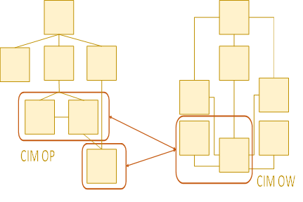

### Onderdelen van de CIM-producten

Onderstaande CIM-producten zijn voor handen:

-   CIM-OW (Omgevingswet) beschrijft de informatie van de omgevingswet in een
    informatiekundig perspectief (niet tekstgericht, maar objectgericht), met
    objecten, hun kenmerken en hun onderlinge samenhang, door de bril van de
    Omgevingswet en het Digitaal Stelsel Omgevingswet DSO.

-   CIM-OP (Officiële Publicaties) beschrijft de objecten en samenhang door de
    bril van de Bekendmakingswet en de LVBB en andere systemen voor de
    consolidatie van Officiële Publicaties.

-   Vertaaltabel CIM-OW van/naar CIM-OP.

-   Vertaaltabel CIM-OW naar entiteiten in TPOD-UML schema’s.

-   Vertaaltabel CIM-OW naar entiteiten en kenmerken (velden) zoals deze kunnen
    voorkomen in een XML-gecodeerd omgevingsdocument INHOUD.xml. Dit document is
    gecodeerd volgens de regels vastgelegd in een TPOD.XML voor het betreffende
    toepassingsprofiel van het omgevingsdocument waarvoor een INHOUD.XML is
    gemaakt.

Verhouding CIM OP en CIM OW

CIM OP en CIM OW zijn beschreven in het huis van de standaarden. In de
paragrafen hierna worden de verschillende vertalingen en vertaaltabellen
beschreven.
