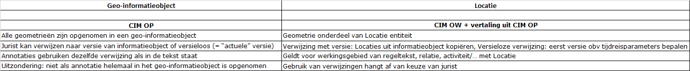

### Vertaaltabel CIM-OW van/naar CIM-OP

Om een STOP-TPOD-gecodeerd omgevingsbesluit te kunnen lezen is het zaak dat er
een vertaaltabel is die XML-gecodeerde INHOUD omzet naar OW-taal (concepten uit
CIM-OW) en daarmee in een uit objecten en objectrelaties opgebouwde tabel. Een
dergelijke vertaling maakt duidelijk hoe een karakter-georiënteerd XML bestand,
waarin alle informatie componenten expliciet zijn getypeerd, moet worden gezien
vanuit het perspectief van CIM-OW en CIM-OP. Een XML-bericht wordt dan als het
ware uitgepakt en in een objecten-en-relaties vorm vertaald. Deze vertaling is
nodig omdat in de juridische en publicatiewereld de documentgerichte benadering
(OP XML) *de facto* standaard representatievorm is.

Vertaling van CIM OW naar CIM OP en weer naar CIM OW in DSO-LV

In de wereld van informatiesystemen en het DSO worden gegevens relationeel en
objectgericht ontsloten en is bestandsformaat JSON de standaard. Het transport
van gegevens over OW-besluiten vindt plaats in XML gecodeerde berichten, en
volgt een documentaire opzet.

Simpel gezegd wordt CIM OW vertaald naar CIM OP waar het de techniek (STOP)
betreft en weer naar CIM OW om leesbaar te blijven voor gebruikers van het
DSO-LV.

Eenvoudige weergave van de vertaling CIM-OW \> CIM-OP \> CIM-OW

De vertaaltabel is geen 1:1-tabel omdat de juristen die namens het bevoegd gezag
de regels en werkingsgebieden formuleren, veel keuzevrijheden hebben. Bevoegd
gezag heeft binnen de kaders van de wet namelijk beleidsvrijheid. Zij kan
derhalve het ‘WAT’ van de regels en ‘WAAR’ van de werkingsgebieden bij die
regels autonoom bepalen (binnen de spelregels van de omgevingswet).

Tegelijk legt de Bekendmakingswet spelregels op over de vorm (XML codering en
metadata) waarin een OW-besluit moet worden aangeboden. Omdat vanuit de optiek
van het beoogde gebruik van het DSO de inhoud van het Ow-besluit ook
betekenisvol herkend zou moeten kunnen worden, worden deze gegevens geannoteerd.
Deze annotaties vertellen hoe de tekst en relaties tussen onderdelen van de
tekst en geometrie die het werkingsgebied beschrijft, machine-leesbaar
geïnterpreteerd dienen te worden. Zijn er geen annotaties, dan kan de computer
de mens-leesbare verbanden in de regel niet leggen en raken we informatie in
praktische zin kwijt.

Voorbeeld van een vertaling CIM OP en CIM OW

De manier modelleren van het Ow-besluit bepaalt hoe de inhoud in XML-termen
gecodeerd wordt en waar deze in het digitale besluit teruggevonden kan worden.

Zo kan een opsteller van een besluit op diverse niveaus de inhoud van de regels,
in de regeltekst opgenomen inhoud, computer-leesbaar duiden met annotaties. In
regeling-gerichte Ow-besluiten is dat op het niveau van een artikel of/en een
lid. We noemen dat *opline-annotaties*; deze betreffen het hele artikel of lid.
Daarnaast kan informatie in de regeltekst of in een informatieobject worden
geplaatst. Dat zijn zogeheten *inline-annotaties*; deze betreffen een onderdeel
van de artikel of lid tekst.

Daarmee bepaalt de regelmaker de hoeveelheid regels in een artikel en/of lid en
tevens het niveau van annoteren en dus ook waar de inhoud teruggevonden kan
worden.

De vertaaltabel (de plek in het XML-bericht) is dus situatieafhankelijk!

Anders dan gebruikelijk is de vertaaltabel dus niet 1:1 maar
situatie-afhankelijk. De manier waarop het bevoegd gezag de inhoud heeft
gemodelleerd, bepaalt dus waar de juridisch relevante informatie (binnen
besluit) en de informatie over de gegevens in het besluit (buiten besluit)
landen in de XML gecodeerde STOP-TPOD besluiten. Bij het ontrafelen/decoderen
van een geconsolideerde regeling uit een toestand-gebaseerd deel hiervan, worden
de objecten uit CIM-OW dus situatieafhankelijk gevuld. Het OZON, het voorportaal
van het LV-DSO, voert deze ontrafeling van XML-gecodeerde toestandsberichten
verkregen vanuit de LVBB uit.
